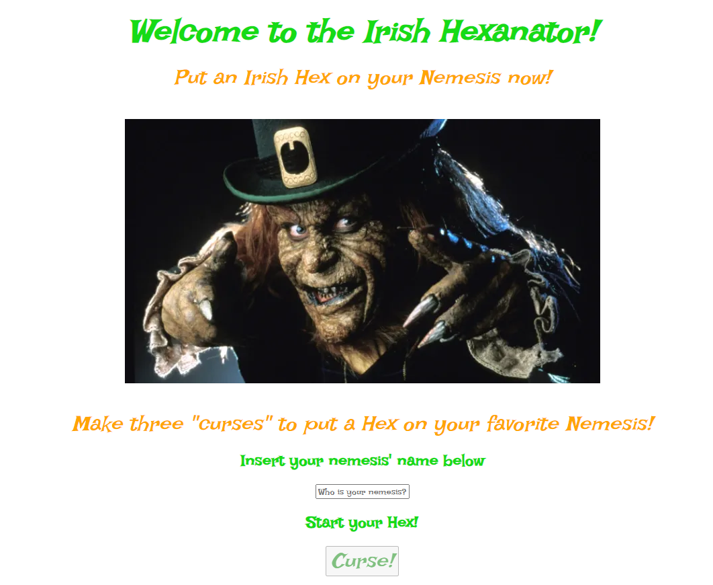
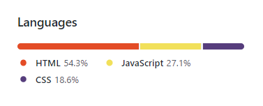

#The Irish Hexanator

# **The Irish Hexanator**

For my second Portfolio Project submitted as part of the Code Institute's Diploma in full-stack software development course, I created a fun and engaging game-like random word generator called 'The Irish Hexanator'. 

- **[Click Here]()** to see the deployed website. 

- To view the repository on Github **[Click Here](https://github.com/SamOBrienOlinger/The-Irish-Hexanator)**.

- This website was designed for Desktop users first and is responsive for users of smaller devices.  

## **Summary**
  This interactive website provides users with a fun and easy way to 'cast a spell' on anyone they want. This spell is no ordinary magic, it is an evil and unique one with a specifically Irish dimension. To virtually 'put a Hex' or digital 'curse' on someone, the user generates a number of random phrases that can be combined to create a full sentence. The user can create as many different sentences or 'Hexes' as they like, as often as they want, and using as many names of friends or family as they desire.        
  
  Unlike many other websites that may provide users with a random word generator, this project offers users a unique opportunity to create their own personlised phrase that is intended to be shared on social media platforms for fun.   

The site targets a wide variety of users anywhere in the world who:

* enjoy interactive websites 

* find Irish phrases ammusing. 

Perhaps most importantly, what makes this website stand out from other websites that may also generate random phrases is how this fun application enhances the UX for users who: 

* already familar with word games and generatorsm but would like to expereince something new that is made even more novel because of it's Irish context 

* appreciate the anticipation that builds with each button clicked to cinrementally build a full sentence that can be shared 

## **[Contents](#contents)**

1. **[Features](#features)**
2. **[Deployment](#deployment)**
3. **[Features Left to Implement](#features-left-to-implement)**
4. **[Testing](#testing)**
5. **[Unfixed Bugs](#unfixed-bugs)**
6. **[Technologies and Tools](#technologies-and-tools)**
7. **[Credits](#credits)**
8. **[Acknowledgements](#acknowledgements)** 

## **[Features](#features)**

The website consists of one page with multiple sections:

* [Homepage](#homepage)
* [Back to top button](#back-to-top-button)
* [Footer](#footer)

### **[Homepage](#homepage)** 

  - The landing page immediately engages the user with a large hero image. The image is of a fun and scary leprechaun. This aims to set the user's expectations around the purpose of this website and to illicit a positive emotional response from the user from the very start of their experience.  

   
   

  #### **Content on Homepage**

  - The body element is divided into a number of sections with instructions fo the user to carry out step-by-step to incrementally build a full sentence by inputting a name then clicking on the 'curse' buttons. The purpose of multiple steps is to (a) differentiate this project from other simpler random word generators and (b) build the user's anticipation of seeing the final product at the end after the four easy steps of clicking or 'cursing' three times and then clikcing one more time to see the entire perosanilsed 'Hex'. 
    

### **[Back to top button](#back-to-top-button)**

  - When the user clicks on the last button on the Homepage, this feature aims to enhance their experience and meet their expectations of not only bringing the user back to the top of the page, but also of refreshing the page and being able to begin the process again in order to get out a new 'Hex'.    

    

### **[Footer](#footer)** 

   

  - The footer section includes links to the relevant social media sites which would connect users with social media for The Irish Hexanator. The links open to a new tab to allow easy navigation for the user. The initial code for the social media icons for the footer was based on those found in the Code Institute's [Love Running Project](https://code-institute-org.github.io/love-running-2.0/index.html) and then altered to match and be consistent with the color scheme of this project.    

  - The footer is valuable to the user as it encourages them to post their 'Hex' via social media, further enhancing the UX.

  - The icons for the footer were taken from [Font Awesome](https://fontawesome.com/) and styled to match the color-scheme based on the Irish flag's colors. 

## **[Deployment](#deployment)**

- The site was deployed to GitHub pages using the following steps:

  - In the GitHub repository, navigate to the Settings tab 
  - From the source section drop-down menu, select the Main Branch
  - Once the Main Branch has been selected, click on the save button. The page will be automatically refreshed, a link proved, and a detailed ribbon displayed to indicate the successful deployment. 

  - The live link can be found [Here]()

 ### **Deploy locally and contribute to the Project** 
  
 
Once you have a GitHub account and installed the Gitpod Chrome Extension follow the steps below:

1.	Log in to your Gitpod account.
2.	Open the project repository in a new tab.
3.	Click on the green "Gitpod" button to the top right of the project.
4.	This will automatically create a new Gitpod workspace for you to work on. You can type in any name of your choosing.

To clone this project:

1.	Log into Github
2.	Navigate to the Project repository
3.	Click the green Gitpod button in the top right corner of the repository
4.	This will create a new Gitpod workspace

To work on the project locally:

1.	Click on the Code button
2.	In the drop-down menu that appears, copy the URL
3.	In your local IDE, open a new terminal
4.	Type git clone and paste the URL you copied in Step 2
5.	Press Enter

Alternatively, once you have found the project repository in Github, you can click on the Code button and in the dropdown menu, click on the Download Zip button. 

  

## **[Features Left to Implement](#features-left-to-implement)**

- Ideas for future features include: 

  - A way for users to add and play with their own curses to prodice unique personalised 'Hexes'. 

  - More images and videos that are relevant could be added to enhanve UX 

  - A commercial page with branded merchandise with personalised 'Hexes' printed on them, such as T-Shirts, hats, mugs and other items generally found in a giftshop.  

  - A live social media platform feed where othere user's 'Hexes' can share and compare ideas for curses with images in real-time with each other. 

  - An educational feature exploring Irish folklore, myths and legends with information about the Irish language and culture surrounding superstitions and the historical origins of curses/hexes. 

## **[Testing](#testing)**
   
 - **Validator Testing**

   - **HTML**

     I began testing the HTML code early on in the project, to methodically ensure that all HTML code was being built on solid foundations across all pages. Initially, I had some basic mistakes about having more than one H1 heading and errors due to opening tags not having corresponding closing tags. With feedback from fellow students via Slack and by using the HTML Validator I have been able to fix these HTML issues.  

      * [Homepage](#homepage)

        

   - **CSS**
    
      Testing the CSS code was also carried out with each developmental stage of the project. Most often the errors that arose were with syntax for media queries and stray curly braces.  

        
    

   - **Lighthouse** 

    Initially, I intended all of the images on the website, especially the Furry Fun Foto Gallery page, to be my own photography with family, my own dog and with friend's pets. However, coordinating this proved to be more time consuming and difficult than I originally envisaged, especially with health implications of socialising due to COVID. Instead, I have used a mix of my own photographs and images from open-source websites covered in the [Images](#used-images) section. 
    
    Below are the Lighthouse scores.    
     
    - Mobile
      
      * [Homepage](#homepage)

            
    - Desktop 

      * [Homepage](#homepage)
          
        
      
          
 - **JavaScript**

   - No errors were found when passing through the official Jshint validator
The following metrics were returned:

     - There are 9 functions in this file.

     - Function with the largest signature take 1 arguments, while the median is 1.

     - Largest function has 8 statements in it, while the median is 2.

     - The most complex function has a cyclomatic complexity value of 3 while the median is 1.

  - **Feature testing**

    Testing all interactive features involved manually clicking on every link on each page.

    - All social media links in footer bring the user to the corresponding social media platform for them to log in. 
    - the input field is interactive and adds the inputted text to the final full sentence or 'Hex'.   

    ## **[Users experience](#users-experience)**

      The target audience was kept as broad as posisble. Challenges and factors thqt had to be kept in mind when developing this project while placing UX at the cntre included: 
      
      - Users' varied levels of digital literacy
      - their familiarity with using games online
      - the general diversity of target users' age range and social backgrounds
      
      I felt I needed to ensure that anyone would be able to navigate and enjoy the website. Keeping it as simple as possible for the user was a main priority. Also, eliciting a positive emotional response from users was central to the success of the website and to achievng the aim of creating and developing a website that would be experienced differnetly and stood out from other kinds of pre-exisiting random word generators.   

## **[Unfixed Bugs](#unfixed-bugs)**

 - I tried adding a GIF image using CSS and a JavaScript function to make it appear only when the user clicks the button that generates the full sentence at the end. However this was ultimately left out because it complicated both the CSS and JavaScript code.   
    
## **[Technologies and Tools](#technologies-and-tools)**
     
- [nssport.com](https://nsspot.herokuapp.com/imagetowebp/) was used to convert images from .png to .webp for improving the lighthouse.
- Gitpod
- Github
- Gitbash
- Google Chrome Dev Tools 
- Font Awesome ("Font Awesome 5 Brands")  
- Prefixed by https://autoprefixer.github.io
- Languages used: 
     - HTML
     - CSS
     - JavaScript

## **[Credits](#credits)**

As a starting point for developing this project, I began with a concept for a random word generator based on a book entitled [The Irish Insult Generator](https://shop.designist.ie/products/irishinsultgenerator). When I did some research online, I found out that an App produced by another party but with almost exactly the same name already existed called [Irish Insult Generator](https://steprimo.com/android/us/app/com.incrediblegeeks.irishinsultgenerator/Irish-Insult-Generator/). I developed the idea to maintain the random word aspect but to enhance this with the idea of 'putting a hex' on a friend and/or family member for fun and allowing the user to post this to their preferred social media platform.   

### **[Code](#code)**

- Below is the code for the footer element. This was based on the footer used in the Code Institute's Love Running Project module:   

~~~
<footer>
        <ul>
            <li>
                <a href="https://facebook.com" target="_blank" rel="noopener"
                    aria-label="Visit our Facebook page (opens in a new tab)"><i class="fab fa-facebook"></i></a>
            </li>
            <li>
                <a href="https://twitter.com" target="_blank" rel="noopener"
                    aria-label="Visit our Twitter page (opens in a new tab)"><i class="fab fa-twitter-square"></i></a>
            </li>
            <li>
                <a href="https://youtube.com" target="_blank" rel="noopener"
                    aria-label="Visit our YouTube page (opens in a new tab)"><i class="fab fa-youtube-square"></i></a>
            </li>
            <li>
                <a href="https://instagram.com" target="_blank" rel="noopener"
                    aria-label="Visit our Instagram page (opens in a new tab)"><i class="fab fa-instagram"></i></a>
            </li>
        </ul>
  </footer>
~~~

   While the above code is essentially the same for the footer in this project, I altered the color to match the color-scheme. In this project the footer aims to enhance UX by offering the user a way to post their 'Hex' to the various social media platforms via the linked icons provided, and to tag their 'Nemesis' for fun.  

### **Content**

- The icons in the footer were taken from [Font Awesome](https://fontawesome.com/)
     
   
 - **[Images](#used-images)**

    - The only image used was dowloaded for free from  [Geeks of Doom](https://geeksofdoom.com/2012/03/20/wwe-films-and-lionsgate-are-teaming-up-to-reboot-leprechaun-franchise)    

## **[Acknowledgements](#acknowledgements)**

  The following online resources were used for a range of supports such as getting correct syntax and learning more about functions:

   - [w3schools](https://www.w3schools.com/)

  - [Stack Overflow](https://stackoverflow.com/)

  - A number of YouTube explainer videos were helpful:

    - [Form Validation with JavaScript - Check for Multiple Empty Text Fields](https://www.youtube.com/watch?v=xvXtb7mwMd8)
    - [How to dynamically disable a form button using Javascript, HTML, and CSS](https://www.youtube.com/watch?v=ge0T4Fl6M3A)
    - [JavaScript for Beginners #6 - Introduction to Functions](https://www.youtube.com/watch?v=JcKse_OhnfQ)
    - [Event Listeners - Javascript - Tutorial 14](https://www.youtube.com/watch?v=jrI0WFCCLWY)

   - My mentor, [Sandeep Aggarwal](https://code-institute-room.slack.com/archives/D02TFLJRZTR), was a great support and he provided key feedback which helped deliver this project.  
   
   - A number of Code Institute Tutors and students were very supportive via slack and the Student Support Live Chat. The following tutors and students helped guide me and to tease out a range of issues I faced developing the project: 
     
      - [DavidK_5P](https://code-institute-room.slack.com/team/U02R7JKTQ6S)
      - [Eventyret_mentor](https://code-institute-room.slack.com/team/U4MVA9YQP)
      - [DaveHorrocks_5P](https://code-institute-room.slack.com/team/U01R68NPPE2)
      - [Ed-ci](https://code-institute-room.slack.com/team/U02FJ8V7NA2)
      - [Ger-ci](https://code-institute-room.slack.com/team/U030LJXSLQH)

**[Click Here](#contents)** to return to Contents